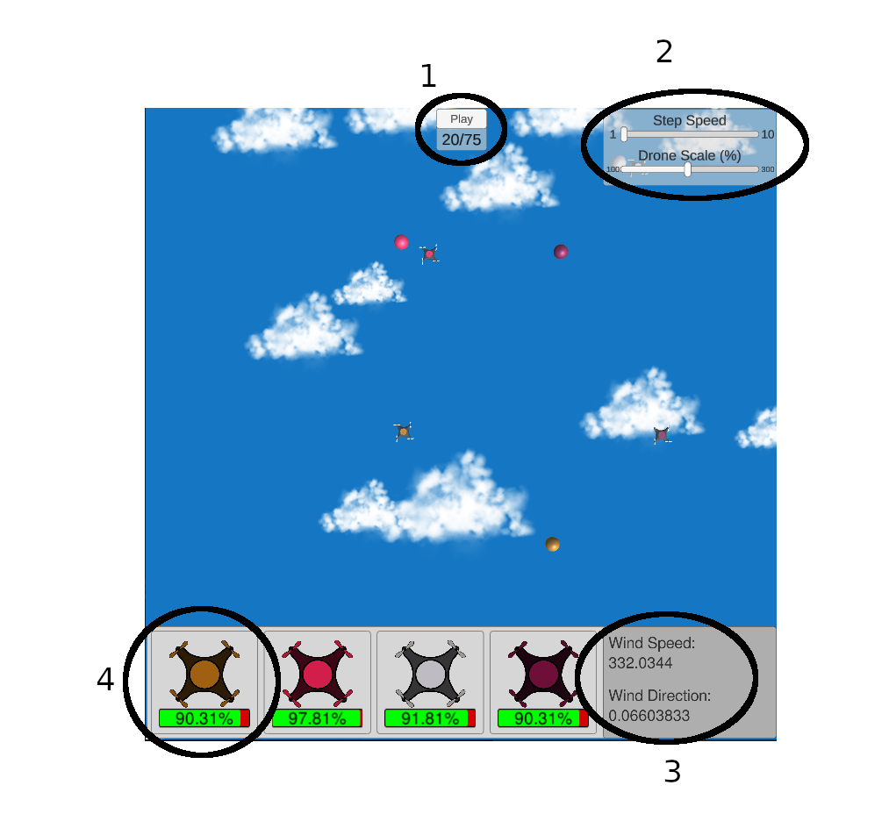

# Drone Visualisation Executables for Windows and Linux

To use either executable, you will need to unzip the files.
Once unzipped follow these instructions to load user episodes, depending on platform:

## Windows

- Run WMG_Drone_Visualisation.exe
- Navigate to the "AppData" folder
- Then navigate to the folder: AppData/LocalLow/WMG/WMG_Drone_Visualisation/UserData
- Once in this folder, you can drop any user created episodes.
- Then Click "Refresh Database" in the executable
- A list of episodes names should now present, click on one to run the episode visualisation

## Linux

- Run Drone_Visualisation_Linux.86_64
- Navigate to the ".config" folder
- Then navigate to the folder: .config/unity3d/WMG/WMG_Drone_Visualisation/UserData
- Once in this folder, you can drop any user created episodes.
- Then Click "Refresh Database" in the executable
- A list of episodes names should now present, click on one to run the episode visualisation

## Scene Controls



- **1**: Play or Pause the Simulation at it's current step. Also displays the current step number and the total number of steps
- **2**: Sliders to change the step speed,(larger number = slower simulation) and also the drone scale.
- **3**: Current Wind Speed and Wind Direction Values
- **4**: The Drone battery level

## File Formatting
The files for user made episodes need to be in a .json format. The structure of which needs to look as follows. Any deviation from this will result in an error and not display in the list.

The Episode will need to contain an array of **"steps"**, each step contains:
- An **"agentList"** array
- A **"landmarkList"** array
- A **"wind_direction"** float
- A **"wind_speed"** float

Each Agent in an **"agentList"** will need to contain:
- A **"battery_level"** float
- A **"color"**, containing an **"r"**,**"g"** and **"b"** value float
- A **"position"**, containing an **"x"** and **"y"** value float
- A **"velocity"**, containing an **"x"** and **"y"** value float

Each Landmark in a **"landmarkList"** will need to contain:
- A **"color"**, containing an **"r"**,**"g"** and **"b"** value float
- A **"position"**, containing an **"x"** and **"y"** value float

### Example (1 Step):

```
{
"steps": [
        {
            "agentList": [
                {
                    "battery_level": 1.0,
                    "color": {
                        "b": 0.07003136458816728,
                        "g": 0.3757589872128767,
                        "r": 0.6249486750959569
                    },
                    "position": {
                        "x": -3.616194739002526,
                        "y": -4.224525994847232
                    },
                    "velocity": {
                        "x": 0.0,
                        "y": 0.0
                    }
                },
                {
                    "battery_level": 1.0,
                    "color": {
                        "b": 0.29448683194028324,
                        "g": 0.11927637600806196,
                        "r": 0.8184164042611288
                    },
                    "position": {
                        "x": -2.9989177169871226,
                        "y": 1.9332900714013386
                    },
                    "velocity": {
                        "x": 0.0,
                        "y": 0.0
                    }
                },
                {
                    "battery_level": 1.0,
                    "color": {
                        "b": 0.7632263037319416,
                        "g": 0.7328934951373707,
                        "r": 0.7449795622110315
                    },
                    "position": {
                        "x": -2.2425579173577903,
                        "y": -3.181228342432909
                    },
                    "velocity": {
                        "x": 0.0,
                        "y": 0.0
                    }
                },
                {
                    "battery_level": 1.0,
                    "color": {
                        "b": 0.22325675595213001,
                        "g": 0.06017244355348417,
                        "r": 0.4269212770180425
                    },
                    "position": {
                        "x": -1.972013899831388,
                        "y": 1.047192537253057
                    },
                    "velocity": {
                        "x": 0.0,
                        "y": 0.0
                    }
                }
            ],
            "landmarkList": [
                {
                    "color": {
                        "b": 0.07003136458816728,
                        "g": 0.3757589872128767,
                        "r": 0.6249486750959569
                    },
                    "position": {
                        "x": 0.09344598117607461,
                        "y": -0.9013101006947428
                    }
                },
                {
                    "color": {
                        "b": 0.29448683194028324,
                        "g": 0.11927637600806196,
                        "r": 0.8184164042611288
                    },
                    "position": {
                        "x": -0.3985168538735886,
                        "y": 2.601658560048773
                    }
                },
                {
                    "color": {
                        "b": 0.7632263037319416,
                        "g": 0.7328934951373707,
                        "r": 0.7449795622110315
                    },
                    "position": {
                        "x": -0.8226508895331839,
                        "y": 2.9836161548689777
                    }
                },
                {
                    "color": {
                        "b": 0.22325675595213001,
                        "g": 0.06017244355348417,
                        "r": 0.4269212770180425
                    },
                    "position": {
                        "x": 3.360311104789016,
                        "y": 1.6841313144304983
                    }
                }
            ],
            "wind_direction": 0.019835070105294218,
            "wind_speed": 119.43461789974327
        }
]
}
```
